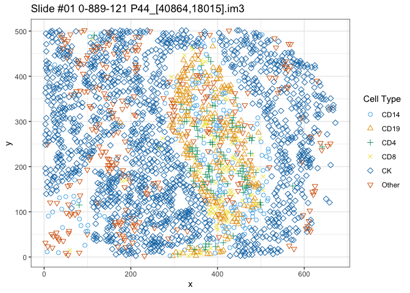

<!-- README.md is generated from README.Rmd. Please edit that file -->

# DIMPLE: **D**istance based **I**nference for **M**ultip**L**ex imaging **E**xperiments

<!-- badges: start -->

[](https://lifecycle.r-lib.org/articles/stages.html#experimental)
[](https://CRAN.R-project.org/package=DIMPLE)
[](https://codecov.io/gh/nateosher/DIMPLE)
<!-- badges: end -->

The goal of DIMPLE is to provide tools and infrastructure to facilitate
the manipulation, exploration, and modeling of multiplex imaging data.

## Installation

You can install the development version of DIMPLE from
[GitHub](https://github.com/) with:

``` r
# install.packages("devtools")
devtools::install_github("nateosher/DIMPLE")
```

To install with vignettes (which we recommend), use the command:

``` r
# install.packages("devtools")
devtools::install_github("nateosher/DIMPLE", build_vignettes = TRUE)
```

## Example

Suppose we’re interested in exploring the lung cancer data from the
[`VectraPolarisData`](https://bioconductor.org/packages/release/data/experiment/html/VectraPolarisData.html)
package. Assuming you’ve already installed that package, we can build a
`MltplxExperiment` object, the core of `DIMPLE`, from the data as
follows:

``` r
library(DIMPLE)
library(tidyverse)
#> ── Attaching core tidyverse packages ──────────────────────── tidyverse 2.0.0 ──
#> ✔ dplyr     1.1.1     ✔ readr     2.1.4
#> ✔ forcats   1.0.0     ✔ stringr   1.5.0
#> ✔ ggplot2   3.4.2     ✔ tibble    3.2.1
#> ✔ lubridate 1.9.2     ✔ tidyr     1.3.0
#> ✔ purrr     1.0.1     
#> ── Conflicts ────────────────────────────────────────── tidyverse_conflicts() ──
#> ✖ dplyr::filter() masks stats::filter()
#> ✖ dplyr::lag()    masks stats::lag()
#> ℹ Use the conflicted package (<http://conflicted.r-lib.org/>) to force all conflicts to become errors
lung_data = VectraPolarisData::HumanLungCancerV3()
#> snapshotDate(): 2022-10-31
#> Warning: package 'ExperimentHub' was built under R version 4.2.1
#> Warning: package 'BiocGenerics' was built under R version 4.2.1
#> Warning: package 'AnnotationHub' was built under R version 4.2.1
#> Warning: package 'BiocFileCache' was built under R version 4.2.2
#> Warning: package 'SpatialExperiment' was built under R version 4.2.2
#> Warning: package 'SingleCellExperiment' was built under R version 4.2.2
#> Warning: package 'SummarizedExperiment' was built under R version 4.2.1
#> Warning: package 'MatrixGenerics' was built under R version 4.2.1
#> Warning: package 'GenomicRanges' was built under R version 4.2.1
#> Warning: package 'S4Vectors' was built under R version 4.2.2
#> Warning: package 'IRanges' was built under R version 4.2.1
#> Warning: package 'GenomeInfoDb' was built under R version 4.2.2
#> Warning: package 'Biobase' was built under R version 4.2.1
#> see ?VectraPolarisData and browseVignettes('VectraPolarisData') for documentation
#> loading from cache

# Get the x coordinates for the cells
cell_x_coords = SpatialExperiment::spatialCoords(lung_data)[,1] %>% as.numeric()
# Get the y coordinates for the cells
cell_y_coords = SpatialExperiment::spatialCoords(lung_data)[,2] %>% as.numeric()
# Get the patient ids for the slides
patient_ids = lung_data$slide_id
# Get the slide ids for the slides
slide_ids = lung_data$sample_id

# Map phenotypes to character vector - there are more efficient ways to do this,
# but this way is the most legible
test_n = length(lung_data$phenotype_cd14)
tictoc::tic()
cell_marks = tibble(
  cd_14 = lung_data$phenotype_cd14[1:test_n] == "CD14+",
  cd_19 = lung_data$phenotype_cd19[1:test_n] == "CD19+",
  cd_4 = lung_data$phenotype_cd4[1:test_n] == "CD4+",
  cd_8 = lung_data$phenotype_cd8[1:test_n] == "CD8+",
  ck = lung_data$phenotype_ck[1:test_n] == "CK+",
  other = lung_data$phenotype_other[1:test_n] == "Other+"
) %>%
  as.matrix() %>%
  (\(m){
    m %*% 1:6
  }) %>%
  map_chr(\(x) c(NA, "CD14", "CD19", "CD4", "CD8", "CK", "Other")[x + 1])

na_marks = which(is.na(cell_marks))

na_marks = which(is.na(cell_marks))
cell_x_coords = cell_x_coords[-na_marks]
cell_y_coords = cell_y_coords[-na_marks]
patient_ids = patient_ids[-na_marks]
slide_ids = slide_ids[-na_marks]
cell_marks = cell_marks[-na_marks]

lung_experiment = DIMPLE::new_MltplxExperiment(
  x = cell_x_coords,
  y = cell_y_coords,
  marks = cell_marks,
  slide_id = slide_ids
)

lung_experiment
#> MltplxExperiment with 761 slides
#> No intensities generated
#> No distance matrices generated
#> No attached metadata
```

This object can be indexed like a list- each entry is of class
`MltplxObject`, and stores data about a particular biopsy:

``` r
lung_experiment[[1]]
#> MltplxObject 
#> Slide id: #01 0-889-121 P44_[40864,18015].im3 
#> Image with 2336 cells across 6 cell types
#> Cell types: CD14, CD19, CD4, CD8, CK, Other 
#> No intensity generated (yet)
#> No distance matrix generated (yet)
```

Using the implemented generic functions, this allows for quick
inspection of a given biopsy:

``` r
plot(lung_experiment[[1]])
```



To learn more about these data structures and how to utilize them for
exploration, check out the `mltplx-experiment` vignette. `DIMPLE` also
provides functions for simulating Multiplex Imaging data- an overview of
this functionality can be found in the `simulations` vignette
